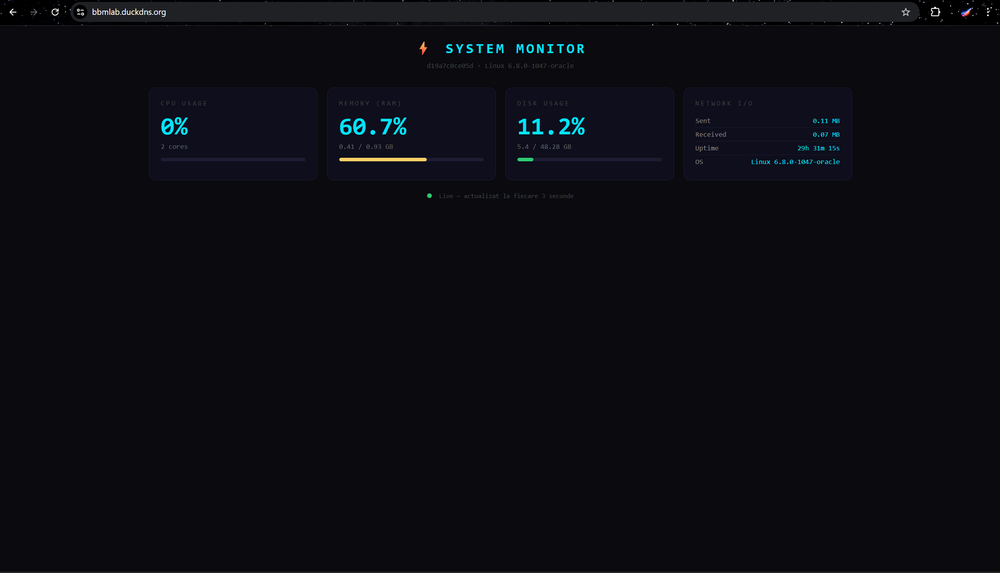

# ⚡ BBM System Monitor — DevSecOps Portfolio

> Live system monitoring dashboard cu pipeline CI/CD complet, security scanning automat și deploy pe VPS.

[](https://github.com/1SeaDarkNess1/devsecops_portfolio/actions/workflows/ci.yml)
[](https://github.com/1SeaDarkNess1/devsecops_portfolio/actions/workflows/deploy.yml)


## 🌐 Live Demo

**[bbmlab.duckdns.org](https://bbmlab.duckdns.org)**



---

## 📋 Despre proiect

Un dashboard web care afișează în timp real metricile serverului (CPU, RAM, Disk, Network), construit cu o infrastructură DevSecOps completă:

- **La fiecare `git push`** → pipeline-ul CI rulează automat security scanning
- **Dacă totul e verde** → codul se deployează automat pe VPS fără intervenție manuală
- **Aplicația e containerizată** cu Docker și servită prin Nginx cu SSL

---

## 🏗️ Arhitectură

```
Developer (git push)
        │
        ▼
GitHub Actions CI Pipeline
        ├── Gitleaks (secret scanning)
        ├── Semgrep (SAST - analiză cod)
        └── Trivy (vulnerabilități container)
                │
                │ doar dacă totul e OK
                ▼
GitHub Actions CD Pipeline
        └── Deploy automat pe VPS
                │
                ▼
        Oracle Cloud VPS (Frankfurt)
                ├── Nginx (reverse proxy + SSL)
                ├── Let's Encrypt (certificate HTTPS)
                └── Docker Container (Flask app)
```

---

## 🔒 Pipeline DevSecOps

### CI — Security Scanning (ci.yml)

| Tool | Scop |
|---|---|
| **Gitleaks** | Detectare parole/chei uitate în cod |
| **Semgrep** | Analiză statică — vulnerabilități logice (SAST) |
| **Trivy** | Scanare vulnerabilități în container și dependențe |

Pipeline-ul **eșuează automat** dacă găsește vulnerabilități CRITICAL sau HIGH — codul nu ajunge pe server dacă nu e sigur.

### CD — Deploy Automat (deploy.yml)

Se declanșează **doar după CI cu succes**:
1. Copiază codul pe VPS prin SSH
2. Oprește containerul vechi
3. Build imagine Docker nouă
4. Pornește noul container

---

## 🛠️ Stack Tehnologic

| Categorie | Tehnologie |
|---|---|
| Backend | Python 3.11 + Flask |
| Containerizare | Docker |
| Web Server | Nginx (reverse proxy) |
| SSL | Let's Encrypt + Certbot |
| CI/CD | GitHub Actions |
| Secret Scanning | Gitleaks |
| SAST | Semgrep |
| Container Scan | Trivy (Aqua Security) |
| Hosting | Oracle Cloud Free Tier (Frankfurt) |
| DNS | DuckDNS |
| OS | Ubuntu 22.04 LTS |

---

## 🚀 Setup local

```bash
# Clonează repo-ul
git clone https://github.com/1SeaDarkNess1/devsecops_portfolio
cd devsecops_portfolio

# Rulează cu Docker
docker build -t bbm-sysmon .
docker run -p 5000:5000 bbm-sysmon

# Accesează
open http://localhost:5000
```

---

## 📡 API Endpoints

| Endpoint | Descriere |
|---|---|
| `GET /` | Dashboard principal |
| `GET /api/metrics` | Metrici sistem în format JSON |
| `GET /health` | Health check (folosit de Docker) |

---

## 👤 Autor

**Bogdan Mihai Bontoș**
- Locul 18 național AcadNet 2026 (Calc 11-12)
- Colegiul Național "Vasile Lucaciu" Baia Mare
- Pre-admis UPB ACS CTI

---

*Proiect realizat ca parte din pregătirea practică pentru cariera DevSecOps*
